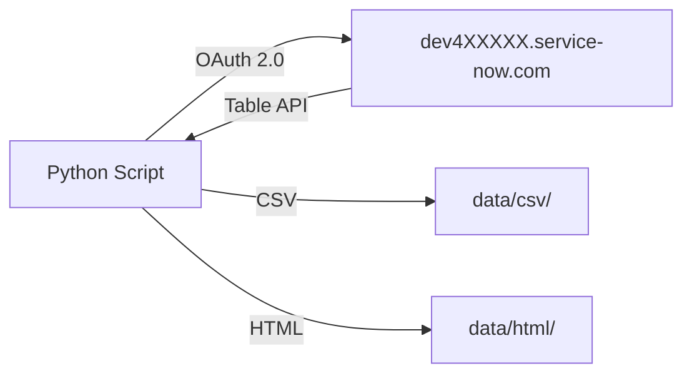

# ServiceNow CMDB & Asset Management API

> REST API integration scripts for ServiceNow CMDB and Asset Management — dev instance `dev4XXXXX.service-now.com`

## Overview

8 Python scripts demonstrating CI lifecycle management via the ServiceNow Table API, authenticated with OAuth 2.0 (password grant type).

## Prerequisites

- Python 3.10+
- ServiceNow developer instance (dev4XXXXX.service-now.com)
- OAuth 2.0 credentials (client ID, client secret, username, password)

## Setup

```bash
pip install -r requirements.txt
cp .env.example .env   # fill in your credentials
```

## Scripts

| # | Script | Description |
|---|--------|-------------|
| 1 | `01_query_ci.py` | Query configuration items by class, status, and location |
| 2 | `02_relationships.py` | Map CI-to-CI relationships and dependency chains |
| 3 | `03_health_check.py` | Score CI health based on last seen, compliance, and incidents |
| 4 | `04_asset_lifecycle.py` | Track asset lifecycle stages from procurement to retirement |
| 5 | `05_dependency_map.py` | Build dependency maps for critical business services |
| 6 | `06_audit.py` | Run compliance audits against CMDB and flag discrepancies |
| 7 | `07_batch_report.py` | Export CI and asset data to CSV for Power BI ingestion |
| 8 | `08_dashboard.py` | Generate interactive Plotly HTML dashboard |

## Outputs

- `data/csv/` — exported CI and asset data (sample files included, real data generated by script 7)
- `data/html/` — Plotly dashboard HTML (generated by script 8 when run)

## Data Flow



## Authentication

All scripts load credentials from `.env`:

```python
SN_INSTANCE_URL = https://dev4XXXXX.service-now.com
SN_CLIENT_ID = your_client_id
SN_CLIENT_SECRET = your_client_secret
SN_USERNAME = your_username
SN_PASSWORD = your_password
```
