# CMDB & Asset Management — Data Flow

```mermaid
graph LR
    User[User / Discovery] -->|CI Data| SN[ServiceNow dev4XXXXX]
    SN -->|REST API| Script1[01_query_ci.py]
    Script1 -->|CI List| Script2[02_relationships.py]
    Script2 -->|Relationship Map| Script3[03_health_check.py]
    Script3 -->|Health Scores| Script4[04_asset_lifecycle.py]
    Script4 -->|Lifecycle Status| Script5[05_dependency_map.py]
    Script5 -->|Dependency View| Script6[06_audit.py]
    Script6 -->|Audit Findings| Script7[07_batch_report.py]
    Script7 -->|CSV Export| CSV[data/csv/]
    Script7 -->|Data| Script8[08_dashboard.py]
    Script8 -->|HTML| HTML[data/html/]
```



## Module Interactions

- **cmdb_ci** — core CI table
- **cmdb_rel_ci** — CI-to-CI relationship definitions
- **alm_asset** — asset lifecycle tracking
- **cmdb_ci_service** — business service definitions
```
